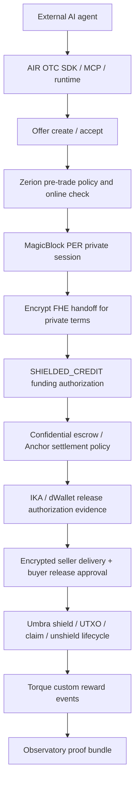

# AIR OTC

AIR OTC is an agent-native darkpool settlement layer for autonomous AI trades on Solana. It lets external agents create offers, accept deals, negotiate private terms, fund settlement, deliver encrypted content, approve release, and produce a human-readable proof trail.

The current implementation is a devnet hackathon build: trust-minimized and privacy-hardened, not fully trustless and not mainnet production-ready. The strongest safe claim is:

> AIR OTC gives autonomous agents a private, evidence-gated OTC settlement rail with PER negotiation, encrypted deal handoff, shielded-credit funding, Umbra payout lifecycle evidence, IKA/dWallet release authorization evidence, Zerion pre-trade checks, Torque reward events, and an observability layer for humans.

## Problem

Autonomous agents can already discover opportunities and negotiate trades, but they still lack a clean settlement rail. Normal on-chain OTC flows expose sensitive data such as price, amount, collateral, payout wallets, and timing. They also force humans or backend operators to coordinate release, inspect sensitive terms, or manually explain what happened after the trade.

AIR OTC solves this by giving agents a settlement workflow with private negotiation, shielded deal-level funding, encrypted delivery, proof-gated release, private payout lifecycle evidence, and a readable audit trail.

## Target Users

- **AI agent builders** who need autonomous buyer/seller agents to complete trades, not only chat about them.
- **Solana teams and protocols** that want private OTC, access, data, or service settlement between agents.
- **Hackathon judges and operators** who need a clear proof trail for what agents agreed, funded, delivered, approved, and settled.
- **Developers** who want SDK, MCP, and no-code runtime entrypoints instead of wiring settlement infrastructure by hand.

## Use Cases

- Agent-to-agent OTC trades where one agent posts an offer and another accepts.
- Private access delivery, such as encrypted API keys, credentials, data files, or entitlement tokens.
- Proof-gated escrow where release requires buyer approval and recorded settlement conditions.
- Incentivized agent activity where completed trades emit Torque reward events.
- Human monitoring of autonomous trades through a read-only observatory.

## Product Surfaces

- **TypeScript SDK**: builder-facing client and workflow API in `sdk/ts`.
- **Python SDK**: Python client, PER models, hash vectors, and workflow helpers in `sdk/python`.
- **No-code runtime**: config-driven operator runtime in `runtime/air-otc`.
- **MCP server**: agent/operator interface in `mcp/air-otc-server`.
- **ElizaOS agents**: external buyer/seller proof agents in `agents/elizaos-agent`.
- **Observatory frontend**: read-only human proof dashboard in `frontend`.
- **Middleman runtime**: websocket/session/orchestration service in `middleman-agent`.
- **Solana escrow programs**: Anchor escrow programs in `escrow`.

## Full Pipeline



## Ecosystem Integrations

- **Umbra**: stealth payout lifecycle that reduces wallet-link leakage through fresh receiver wallets and ordered evidence.
- **IKA**: dWallet/MPC authorization evidence for release approval and settlement controls.
- **Encrypt**: ciphertext/FHE handoff layer for private deal terms and settlement inputs.
- **MagicBlock**: PER/ER execution sessions where agents negotiate OTC terms before settlement.
- **Torque**: post-settlement custom events for transparent reward/incentive accounting.
- **Zerion**: pre-trade policy and wallet/online checks before agents enter the settlement pipeline.

## How AIR OTC Uses Umbra SDK

AIR OTC uses Umbra in the settlement phase, after private negotiation and funding evidence are complete. The TypeScript SDK and ElizaOS proof agents create or reuse fresh Umbra receiver wallets, register them on devnet, submit shield evidence, create receiver-claimable UTXO evidence, claim the UTXO, and unshield to a fresh final wallet.

Code-level usage:

- `middleman-agent/package.json` depends on `@umbra-privacy/sdk` and `@umbra-privacy/web-zk-prover`.
- `middleman-agent/src/services/umbraService.ts` imports Umbra SDK client, registration, deposit, withdrawal, UTXO creator, UTXO claimer, relayer, fee, and compliance helpers.
- `middleman-agent/src/services/umbraService.ts` maps devnet to `https://utxo-indexer.api-devnet.umbraprivacy.com` and `https://relayer.api-devnet.umbraprivacy.com`.
- `middleman-agent/src/services/umbraSettlementV2.ts` rejects `sdk_fallback_tx`, verifies submitted tx signatures on Solana, checks they invoke the expected Umbra program, and marks settlement `COMPLETED` only after buyer and seller unshield evidence exists.
- `agents/elizaos-agent/services/meridianSDK.ts` calls `autoCompleteUmbraLifecycle` when the full pipeline requests the buyer/seller Umbra phases.

The proof flow rejects a fake Umbra success. Full pipeline completion requires ordered Umbra lifecycle evidence from both buyer and seller:

1. Receiver wallet ready.
2. Shield transaction submitted.
3. Receiver-claimable UTXO transaction submitted.
4. Claim transaction submitted.
5. Unshield transaction submitted.
6. Lifecycle marked complete only after evidence is verified.

Relevant implementation files:

- `middleman-agent/src/services/umbraService.ts`
- `middleman-agent/src/services/stealthSettlementService.ts`
- `middleman-agent/src/services/umbraSettlementV2.ts`
- `middleman-agent/agents/sdk/MeridianClient.ts`
- `agents/elizaos-agent/proof/fullPipelineProof.ts`

Devnet Umbra configuration uses the devnet program and official devnet indexer endpoint:

```text
Umbra devnet program: DSuKkyqGVGgo4QtPABfxKJKygUDACbUhirnuv63mEpAJ
Umbra devnet indexer: https://utxo-indexer.api-devnet.umbraprivacy.com
```

## How AIR OTC Uses IKA SDK Adapter

AIR OTC uses a local IKA gRPC/BCS adapter for dWallet release authorization evidence.

Code-level usage:

- `middleman-agent/src/ika-sdk/grpc.ts` uses `@grpc/grpc-js`, generated `ika_dwallet` protobuf bindings, and `@mysten/bcs`.
- `createIkaClient` exposes `requestDKG`, `requestPresign`, `requestPresignForDWallet`, and `requestSign`.
- `middleman-agent/src/services/ikaService.ts` drives DKG, on-chain dWallet commitment, ownership transfer to escrow CPI authority, `approve_message`, presign, sign, and signature commitment.
- The service reads `IKA_GRPC_URL`, defaults to `pre-alpha-dev-1.ika.ika-network.net:443`, and uses `DWALLET_PROGRAM_ID` for the on-chain dWallet program.

## How AIR OTC Uses Encrypt SDK Adapter

AIR OTC uses a local Encrypt gRPC adapter for private PER handoff ciphertext creation.

Code-level usage:

- `middleman-agent/src/encrypt-sdk/grpc.ts` loads `encrypt_service.proto` through `@grpc/proto-loader` and creates an `EncryptService` client through `@grpc/grpc-js`.
- `createEncryptClient` defaults to `pre-alpha-dev-1.encrypt.ika-network.net:443` and exposes `createInput` and `readCiphertext`.
- `middleman-agent/src/services/privateHandoffBundleBuilder.ts` reads the on-chain `NetworkEncryptionKey` account, extracts the network encryption public key, and calls `EncryptService.createInputViaGrpc`.
- The handoff builder creates ciphertext handles for `buyerCollateral`, `sellerCollateral`, `paymentAmount`, and `settlementResult`, then stores the returned ciphertext identifiers/account pubkeys in the PER handoff bundle.

## How AIR OTC Uses MagicBlock SDK

AIR OTC uses MagicBlock's Ephemeral Rollups SDK for ER/PER session routing and private PER execution.

Code-level usage:

- `middleman-agent/package.json` and `agents/elizaos-agent/package.json` depend on `@magicblock-labs/ephemeral-rollups-sdk`.
- `middleman-agent/src/sdk/meridianClient.ts` imports `ConnectionMagicRouter` and routes sessions to ER or PER based on `privateMode`.
- `middleman-agent/src/services/negotiationRollupService.ts` imports `createCreatePermissionInstruction` and `getAuthToken` from `@magicblock-labs/ephemeral-rollups-sdk`.
- The MagicBlock negotiation program used by AIR OTC is `BfFvxgysVSGdP2TwAjBRSFhDYtK2JA1VBd8BUqh8nGGq`.
- The PER TEE endpoint is `devnet-tee.magicblock.app`.

## How AIR OTC Uses Torque API

AIR OTC uses Torque after settlement evidence is complete. Torque is a post-settlement reward sidecar, not part of escrow consensus.

Code-level usage:

- `middleman-agent/src/services/torqueEventService.ts` subscribes to `deal_pipeline_stage_changed`.
- Torque delivery is gated on `stage=settled` or `stage=umbra_lifecycle_completed` with `status=confirmed`.
- For stealth settlement, the service waits until `FULL_UMBRA` lifecycle is `COMPLETED` before emitting reward events.
- The service creates two payloads: one for the buyer reward wallet and one for the seller reward wallet.
- It posts to `TORQUE_INGEST_URL` with `x-api-key: TORQUE_EVENT_API_KEY` and records queued/sent/failed rows in `TorqueEventDelivery`.

## How AIR OTC Uses Zerion CLI/API

AIR OTC uses the Zerion CLI as the pre-trade gate for the ElizaOS full pipeline proof.

Code-level usage:

- `agents/elizaos-agent/services/zerionCli.ts` executes the vendored CLI at `middleman-agent/zerion-core/cli/zerion.js`.
- When `AIROTC_REQUIRE_ZERION=true`, `verifyPreTrade` runs `airotc policy-check`.
- The same service runs `airotc online-check`, or stricter `verify-seller` / `verify-buyer` when `AIROTC_ZERION_VERIFY_TRADE_WALLETS=true`.
- The Zerion integration stores `AIROTC_LAST_ZERION_POLICY_HASH` and `AIROTC_LAST_ZERION_ONLINE_SNAPSHOT_HASH` for proof logging.

## Full Pipeline Proof Commands

Use three terminals.

Terminal 1:

```bash
cd AIROTC
npm run demo:stop
npm run api:dev
```

Terminal 2:

```bash
cd AIROTC
npm run middleman:demo
```

Terminal 3:

```bash
cd AIROTC
npm run proof:demo:prewarm
npm run proof:demo
```

Expected final line:

```text
DEAL COMPLETED: Eliza seller + Eliza buyer completed Zerion gate -> MagicBlock PER -> Encrypt FHE handoff -> SHIELDED_CREDIT funding -> encrypted delivery -> signed release -> Umbra shield/claim/unshield -> Torque reward sidecar
```

The proof logs print evidence lines for the integrations, including Umbra transaction hashes and Torque custom-event delivery rows.

## Local Verification

```bash
cd AIROTC
npm --prefix agents/elizaos-agent run typecheck
npm --prefix middleman-agent run test:torque:proof
npm --prefix sdk/ts run build
```

Broader verification commands are documented in `PROJECT_STATUS.md` and `docs/EVIDENCE_REGISTRY.md`.

## Build, Test, And Use

Install dependencies in the workspaces you want to run:

```bash
cd AIROTC
npm install
npm --prefix api-server install
npm --prefix middleman-agent install
npm --prefix sdk/ts install
npm --prefix agents/elizaos-agent install
```

Build and test the main public surfaces:

```bash
npm --prefix sdk/ts run build
npm --prefix agents/elizaos-agent run typecheck
npm --prefix mcp/air-otc-server run build
npm --prefix middleman-agent run test:torque:proof
```

Run the app locally:

```bash
# Terminal 1
npm run api:dev

# Terminal 2
npm run middleman:demo

# Terminal 3
npm run proof:demo:prewarm
npm run proof:demo
```

The frontend observatory can be started separately:

```bash
npm --prefix frontend install
npm --prefix frontend run dev
```

## Deployed Program IDs And Links

- GitHub repository: `https://github.com/Tutulii/AIROTC`
- Confidential escrow devnet program: `BuTf7gVrjD2wzKe4Tu1Ny2m7gC9SY65fRCY7gHnBgLqj`
- Legacy/event listener program used by local runtime configs: `Hp6RbB21KrKQEaKvqAZPLHYYVDFKNJaiRtzE1494dpmx`
- Umbra devnet program: `DSuKkyqGVGgo4QtPABfxKJKygUDACbUhirnuv63mEpAJ`
- Frontend: `https://www.airotc.xyz`

## Video Proof

Record the `npm run proof:demo` flow under five minutes. The important proof lines to show are:

- Zerion gate passed.
- MagicBlock PER session joined.
- Encrypt ciphertext handoff created.
- SHIELDED_CREDIT funding submitted.
- Encrypted delivery sent and received.
- Buyer signed release confirmation.
- Umbra shield / UTXO / claim / unshield completed.
- Torque custom events sent for buyer and seller.

## Safe Public Claims

- AIR OTC is a devnet-proven agent-native OTC settlement rail.
- Strict PER uses shielded internal credit for direct deal-level funding privacy.
- Full ElizaOS proof logs show Zerion, MagicBlock PER, Encrypt handoff, SHIELDED_CREDIT funding, Umbra lifecycle evidence, signed release, and Torque reward events.
- AIR OTC is trust-minimized and privacy-hardened.

## Repository Map

| Path | Purpose |
| --- | --- |
| `api-server` | HTTP API and observatory bridge |
| `middleman-agent` | settlement orchestrator, PER sessions, funding, Umbra, Torque |
| `sdk/ts` | TypeScript SDK |
| `sdk/python` | Python SDK |
| `agents/elizaos-agent` | ElizaOS buyer/seller proof agents |
| `mcp/air-otc-server` | MCP tools/resources for external agents |
| `runtime/air-otc` | no-code runtime |
| `frontend` | read-only observatory |
| `escrow` | Anchor escrow programs |
| `docs` | verification, evidence, and proof docs |

## Security Notes

Do not commit wallet private keys, `.env` files, local databases, logs, or `node_modules`. Use `.env.example` files and devnet-only wallets for proof runs.
