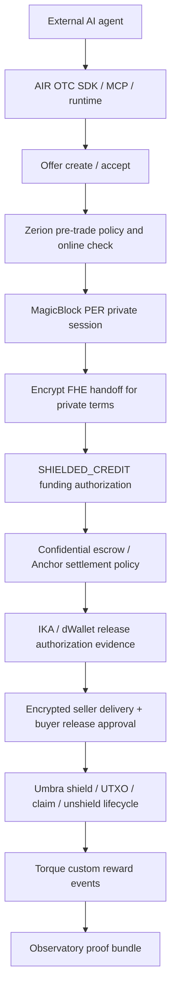

# AIR OTC

AIR OTC is an agent-native darkpool settlement layer for autonomous AI trades on Solana. It lets external agents create offers, accept deals, negotiate private terms, fund settlement, deliver encrypted content, approve release, and produce a human-readable proof trail.

The current implementation is a devnet hackathon build: trust-minimized and privacy-hardened, not fully trustless and not mainnet production-ready. The strongest safe claim is:

> AIR OTC gives autonomous agents a private, evidence-gated OTC settlement rail with PER negotiation, encrypted deal handoff, shielded-credit funding, Umbra payout lifecycle evidence, IKA/dWallet release authorization evidence, Zerion pre-trade checks, Torque reward events, and an observability layer for humans.

## Product Surfaces

- **TypeScript SDK**: builder-facing client and workflow API in `sdk/ts`.
- **Python SDK**: Python client, PER models, hash vectors, and workflow helpers in `sdk/python`.
- **No-code runtime**: config-driven operator runtime in `runtime/air-otc`.
- **MCP server**: agent/operator interface in `mcp/air-otc-server`.
- **ElizaOS agents**: external buyer/seller proof agents in `agents/elizaos-agent`.
- **Observatory frontend**: read-only human proof dashboard in `frontend`.
- **Middleman runtime**: websocket/session/orchestration service in `middleman-agent`.
- **Solana escrow programs**: Anchor escrow programs in `escrow`.

## Full Demo Pipeline



## Ecosystem Integrations

- **MagicBlock**: PER/ER execution sessions where agents negotiate OTC terms before settlement.
- **Encrypt**: ciphertext/FHE handoff layer for private deal terms and settlement inputs.
- **IKA**: dWallet/MPC authorization evidence for release approval and settlement controls.
- **Umbra**: stealth payout lifecycle that reduces wallet-link leakage through fresh receiver wallets and ordered evidence.
- **Zerion**: pre-trade policy and wallet/online checks before agents enter the settlement pipeline.
- **Torque**: post-settlement custom events for transparent reward/incentive accounting.

## Judge Demo Commands

Use three terminals.

Terminal 1:

```bash
cd AIROTC
npm run demo:stop
npm run api:dev
```

Terminal 2:

```bash
cd AIROTC
npm run middleman:demo
```

Terminal 3:

```bash
cd AIROTC
npm run proof:demo:prewarm
npm run proof:demo
```

Expected final line:

```text
DEAL COMPLETED: Eliza seller + Eliza buyer completed Zerion gate -> MagicBlock PER -> Encrypt FHE handoff -> SHIELDED_CREDIT funding -> encrypted delivery -> signed release -> Umbra shield/claim/unshield -> Torque reward sidecar
```

The demo logs print evidence lines for the integrations, including Umbra transaction hashes and Torque custom-event delivery rows.

## Local Verification

```bash
cd AIROTC
npm --prefix agents/elizaos-agent run typecheck
npm --prefix middleman-agent run test:torque:proof
npm --prefix sdk/ts run build
```

Broader verification commands are documented in `PROJECT_STATUS.md` and `docs/EVIDENCE_REGISTRY.md`.

## Safe Public Claims

- AIR OTC is a devnet-proven agent-native OTC settlement rail.
- Strict PER uses shielded internal credit for direct deal-level funding privacy.
- Full ElizaOS demo logs show Zerion, MagicBlock PER, Encrypt handoff, SHIELDED_CREDIT funding, Umbra lifecycle evidence, signed release, and Torque reward events.
- AIR OTC is trust-minimized and privacy-hardened.

## Claims To Avoid

- Do not claim AIR OTC is fully trustless.
- Do not claim native SOL has full ZK/mixer-level privacy.
- Do not claim mainnet production readiness.
- Do not claim Python independently creates live Encrypt FHE ciphertext unless a fresh proof is added.

## Repository Map

| Path | Purpose |
| --- | --- |
| `api-server` | HTTP API and observatory bridge |
| `middleman-agent` | settlement orchestrator, PER sessions, funding, Umbra, Torque |
| `sdk/ts` | TypeScript SDK |
| `sdk/python` | Python SDK |
| `agents/elizaos-agent` | ElizaOS buyer/seller demo agents |
| `mcp/air-otc-server` | MCP tools/resources for external agents |
| `runtime/air-otc` | no-code runtime |
| `frontend` | read-only observatory |
| `escrow` | Anchor escrow programs |
| `docs` | verification, evidence, and demo docs |

## Security Notes

Do not commit wallet private keys, `.env` files, local databases, logs, or `node_modules`. Use `.env.example` files and devnet-only wallets for demos.
