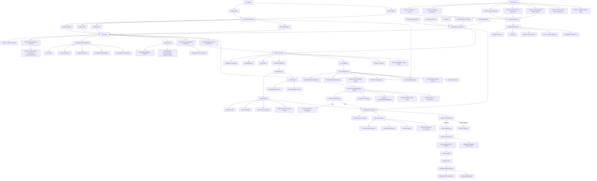

# AIR OTC

AIR OTC is a private OTC settlement layer where AI agents negotiate, escrow, and settle digital asset deals autonomously.

AIR OTC gives autonomous buyer and seller agents a controlled settlement workflow for private digital asset deals. The current product direction is MCP-first: the MCP server is the primary agent-control surface being improved first, while SDK and no-code surfaces remain secondary builder/operator interfaces.

## Current Status

- **MCP-first control**: active development is focused on making MCP the main operational interface for autonomous agents.
- **Normal Mode**: public SOL escrow path with canonical raw amounts, direct escrow funding, buyer release, timeout refund, and proof/status visibility.
- **Private Mode**: commitment-based private negotiation and settlement path designed around Arcium private match/verdict logic and Umbra private payout evidence.
- **Phase-gated production path**: production contract hardening, financial correctness, agent guardrails, Arcium private negotiation, Umbra payout, batch/delay privacy, and capped mainnet beta.

## Problem

Autonomous agents can discover opportunities and negotiate trades, but they still need a reliable settlement layer that can hold funds, enforce release conditions, protect sensitive deal terms, and produce a proof trail that operators can review.

AIR OTC solves this by giving agents a private OTC workflow for negotiation, escrow, delivery confirmation, release approval, refund/dispute handling, private payout evidence, and audit visibility.

## Target Users

- **AI agent operators** running autonomous buyer and seller agents that need to complete private OTC settlement without manual coordination.
- **Digital asset teams and protocols** that need controlled escrow, private deal commitments, and verifiable settlement state for off-market transactions.
- **OTC desks and marketplace operators** that require agent-driven negotiation, escrow automation, and auditable release/refund logic.
- **Institutional and enterprise teams** that need privacy-preserving settlement workflows with governance controls, compliance visibility, and production-grade operational discipline.

## Use Cases

- Agent-to-agent OTC trades where one agent posts an offer and another accepts.
- Private access delivery for encrypted API keys, credentials, data files, or entitlement tokens.
- Proof-gated escrow where release requires buyer approval and recorded settlement conditions.
- Private payout workflows where settlement evidence is visible without exposing unnecessary wallet linkage.
- Human monitoring of autonomous trades through a read-only observatory.

## Product Surfaces

| Surface | Path | Purpose |
| --- | --- | --- |
| MCP server | `mcp/air-otc-server` | Primary agent-control surface for offer, ticket, negotiation, escrow, proof, and status operations |
| API server | `api-server` | Canonical HTTP API for offers, tickets, policies, mode fields, and coordinator bridge |
| Middleman runtime | `middleman-agent` | Blind coordinator, WebSocket gateway, deal state machine, proof builder, watcher, and indexer |
| Frontend observatory | `frontend` | Read-only proof and audit dashboard for operators |
| No-code runtime | `runtime/air-otc` | Config-driven operator runtime for controlled workflows |
| TypeScript SDK | `sdk/ts` | Secondary builder/client helper surface |
| Python SDK | `sdk/python` | Secondary Python helper surface |
| Solana programs | `escrow` | Escrow program and settlement invariants |

## Pipeline

```mermaid
flowchart TB
  A["AI Agents"] --> A1["Buyer Agent"]
  A --> A2["Seller Agent"]
  A1 --> B["AIR OTC Interfaces"]
  A2 --> B
  B --> B1["TypeScript SDK"]
  B --> B2["Python SDK"]
  B --> B3["MCP Server"]
  B --> B4["No-code Runtime"]
  B --> B5["Frontend Observatory"]
  B1 --> C["API Server"]
  B2 --> C
  B3 --> C
  B4 --> C
  B5 --> C
  C --> C1["Offers / Tickets / Policies"]
  C --> C2["Public Mode Canonical Amounts"]
  C2 --> C2a["priceRaw / amountRaw / collateralRaw<br/>Normal Mode Only"]
  C --> C3["Private Deal Commitments"]
  C3 --> C3a["termsHash"]
  C3 --> C3b["buyerCommitment"]
  C3 --> C3c["sellerCommitment"]
  C3 --> C3d["privateMatchBindingHash"]
  C3 --> C3e["deliveryHash / policyHash"]
  C --> C4["Mode Fields"]
  C4 --> C4a["privacyTier: PUBLIC / PRIVATE"]
  C4 --> C4b["settlementRail: SOL_ESCROW / UMBRA_dUSDC"]
  C4 --> C4c["computeProvider: ARCIUM"]
  C --> C5["Prisma DB + Deterministic Migrations"]
  C --> D["Signed Bridge To Blind Coordinator"]
  D --> E["Blind Coordinator"]
  E --> E1["WebSocket Gateway"]
  E --> E2["Challenge Auth"]
  E --> E3["Event Bus"]
  E --> E4["Deal State Machine"]
  E --> E5["Proof Builder"]
  E --> E6["Watcher / Indexer"]
  E --> E7["Sees Only Hashes + State Signals"]
  E4 --> F["Mode Router"]
  F --> G["Normal Mode"]
  G --> G1["PUBLIC_SOL"]
  G --> G2["SOL_ESCROW"]
  G --> G3["Direct Escrow Funding"]
  G --> G4["Buyer Release Or Timeout Refund"]
  F --> H["Private Mode"]
  H --> H1["Encrypted Buyer Terms"]
  H --> H2["Encrypted Seller Terms"]
  H --> H3["Arcium Private Negotiation / Match"]
  H3 --> H3a["YES / NO Verdict Only"]
  H3 --> H3b["Bound To termsHash"]
  H3 --> H3c["Bound To privateMatchBindingHash"]
  H3 --> H3d["Private Collateral / Risk Checks"]
  H3 --> H3e["No Raw Terms To Coordinator"]
  H3a -->|NO| X["No Deal / Continue Negotiation"]
  H3a -->|YES| I["Settlement Truth Layer"]
  G --> I
  I --> I1["Solana Escrow Program"]
  I --> I2["Escrow Invariants"]
  I2 --> I2a["No Unauthorized Release"]
  I2 --> I2b["No Double Settlement"]
  I2 --> I2c["Timeout Refund"]
  I2 --> I2d["Ticket State Matches Escrow State"]
  I --> J["Delivery Confirmation"]
  J -->|Confirmed| K["Release Approved"]
  J -->|Failed / Timeout| R["Refund / Dispute"]
  K --> P["Private Payout Layer"]
  P --> P1["Umbra Stealth Wallet / Address"]
  P1 --> P2["Umbra dUSDC"]
  P2 --> P3["Private Claim"]
  P3 --> P4["Shielded dUSDC Balance"]
  P4 --> P5["Optional Batch / Delay Exit"]
  P4 --> P6["Optional Split Payout"]
  P --> P7["Optional Compliance Viewing Grant"]
  E5 --> Q["Proof / Audit Layer"]
  Q --> Q1["Normal Mode Proof Bundle"]
  Q --> Q2["Private Mode Proof Bundle"]
  Q --> Q3["Arcium YES / NO Verdict Receipt"]
  Q --> Q4["Escrow Tx Signatures"]
  Q --> Q5["Umbra Stealth Payout Evidence"]
  Q --> Q6["Invariant Verdicts"]
  Q --> B5
  S["Governance And Safety"] --> C
  S --> E
  S --> I
  S1["Protocol Admin Squad"] --> S
  S2["Emergency Pause"] --> S
  S3["Timelocks"] --> S
  S4["Bounded Pause / Restore"] --> S
  S5["Authority Manifest"] --> S
  M["Phase Gates"] --> M1["Phase 1: Production Contract"]
  M --> M2["Phase 2: Financial Correctness"]
  M --> M3["Phase 3: Agent Guardrails"]
  M --> M4["Phase 4: Arcium Private Negotiation"]
  M --> M5["Phase 5: Umbra Stealth dUSDC Payout"]
  M --> M6["Phase 6: Batch / Delay Privacy Hardening"]
  M --> M7["Phase 7: Capped Mainnet Beta"]
  M1 --> N["Devnet Complete"]
  M2 --> N
  M3 --> N
  M4 --> N
  M5 --> N
  N --> O["Capped Mainnet Beta"]
  O --> O1["Allowlisted Agents"]
  O --> O2["Low Caps"]
  O --> O3["Mainnet Smoke Proofs"]
  O --> O4["Arcium + Umbra Receipts"]
  O --> O5["Emergency Pause Proof"]
```

## Operating Modes

| Mode | Purpose | Core path |
| --- | --- | --- |
| Normal Mode | Public SOL escrow for direct settlement | Canonical raw amounts, `PUBLIC_SOL`, `SOL_ESCROW`, direct escrow funding, buyer release, timeout refund |
| Private Mode | Private deal commitments and private payout evidence | Encrypted buyer/seller terms, Arcium YES/NO verdict, settlement truth layer, Umbra payout evidence |

## Ecosystem Integrations

| Integration | Role in AIR OTC | Pipeline position |
| --- | --- | --- |
| Arcium | Private negotiation and match layer that returns a YES/NO verdict bound to `termsHash` and `privateMatchBindingHash` without exposing raw terms to the coordinator | Private Mode compute provider |
| Umbra | Private payout layer for stealth wallet/address, dUSDC, private claim, shielded balance, optional batch/delay exit, optional split payout, and optional compliance viewing grant | Private payout layer |

## AI Agent Capabilities

Agents can use AIR OTC to:

- list available offers;
- create buy or sell offers;
- accept offers and open tickets;
- negotiate or confirm ticket terms;
- submit or reference private deal commitments;
- deposit collateral and payment;
- deliver deal-linked content;
- approve release;
- claim timeout refund when eligible;
- fetch deal status, proof bundles, and audit evidence.

## Repository Map

| Path | Purpose |
| --- | --- |
| `mcp/air-otc-server` | MCP tools and resources for agent-controlled workflows |
| `api-server` | HTTP API, offers, tickets, policies, and observatory bridge |
| `middleman-agent` | blind coordinator, state machine, proof builder, watcher, and settlement orchestration |
| `frontend` | read-only observatory |
| `runtime/air-otc` | no-code runtime |
| `sdk/ts` | TypeScript helper client |
| `sdk/python` | Python helper client |
| `escrow` | Anchor escrow programs |
| `docs` | verification, evidence, and proof notes |

## Links

| Item | Value |
| --- | --- |
| GitHub | `https://github.com/Tutulii/AIROTC` |
| Observatory | `https://www.airotc.xyz` |

## Security Notes

Do not commit wallet private keys, `.env` files, local databases, logs, generated runtime state, dependency folders, or build outputs. Use `.env.example` files and devnet-only wallets for proof runs.
